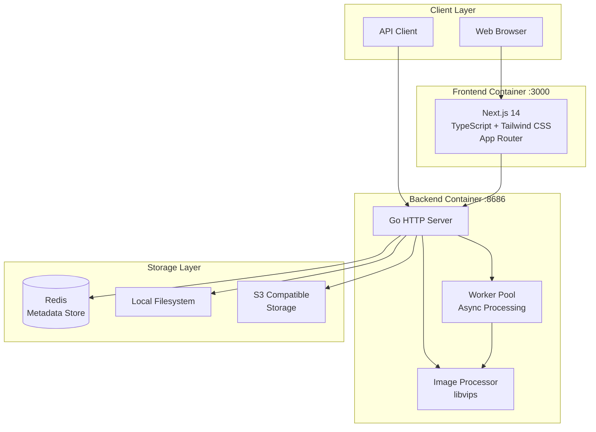

<div align="center">

# ImageFlow


[](https://hub.docker.com/r/losfurina/imageflow-backend)
[](LICENSE)
[](https://go.dev/)
[](https://nextjs.org/)
[](https://deepwiki.com/LosFurina/ImageFlow)

**A modern image management and distribution platform with automatic format optimization**

[English](README.md) | [中文文档](README_CN.md)


</div>

---

## Introduction

ImageFlow is a full-stack image management and OpenAPI platform. It combines a Go image-processing backend, a Next.js management frontend, Redis metadata, local/S3 storage, and an AK/SK-protected OpenAPI layer for external integrations.

## Preview

<div align="center">


</div>

## Architecture



### Component Overview

| Component | Technology | Description |
|-----------|------------|-------------|
| Frontend | Next.js 14, TypeScript, Tailwind CSS | Modern web interface with drag-and-drop upload |
| Backend | Go 1.23+, libvips | High-performance image processing server |
| Metadata | Redis | Fast metadata storage with tag indexing |
| Storage | Local / S3 | Flexible storage backend options |

## Features

### Image Processing

- Automatic conversion to WebP and AVIF formats
- High-performance processing powered by libvips
- Configurable quality and compression settings
- Background worker pool for async processing
- GIF preservation (maintains animation)

### Intelligent Distribution

- Device-aware orientation detection (portrait for mobile, landscape for desktop)
- Browser-based format negotiation (AVIF > WebP > Original)
- Multi-tag filtering with AND logic
- Exclusion filters for sensitive content
- Forced orientation override option

### Storage Options

- Local filesystem storage
- S3-compatible object storage (AWS S3, MinIO, Cloudflare R2, etc.)
- Organized directory structure by orientation and format

### Security

- Internal API key authentication for WebUI and management endpoints
- External AK/SK HMAC authentication for `/openapi/*`
- Role and endpoint-level permission control for OpenAPI clients
- Encrypted SK storage in Redis
- Automatic cleanup of expired images
- Configurable CORS policies
- Sensitive content auto-exclusion from public APIs

### Modern Frontend

- Next.js 14 with App Router
- Drag-and-drop batch upload
- Image management page at `/manage`
- AK/SK management tab for external clients
- Dark mode support
- Responsive masonry layout
- Real-time upload progress

## Deployment

### Prerequisites

- Docker and Docker Compose installed
- Minimum 1GB RAM recommended
- Sufficient disk space for image storage

### Quick Start

```bash
# Clone the repository
git clone https://github.com/LosFurina/ImageFlow.git
cd ImageFlow

# Create configuration file
cp .env.example .env

# Edit configuration (see Configuration section below)
nano .env

# Start all services
docker compose up -d

# Or build locally for development/testing
docker compose -f docker-compose.dev.yaml up --build -d
```

After deployment:

- Web UI: `http://localhost:3000`
- Management UI: `http://localhost:3000/manage`
- Backend API: `http://localhost:8686`
- OpenAPI docs: `http://localhost:3000/openapi/docs` or `http://localhost:8686/openapi/docs/index.html`

For LAN access, replace `localhost` with the server IP, for example `http://192.168.1.4:3000`.

### Service Architecture

The deployment includes three containers:

| Service | Port | Description |
|---------|------|-------------|
| imageflow-frontend | 3000 | Next.js web interface |
| imageflow-backend | 8686 | Go API server |
| imageflow-redis | 6379 | Metadata storage |

## Usage Flow

### 1. Open the Web UI

After Docker starts, open:

- Local machine: `http://localhost:3000`
- LAN device: `http://<server-lan-ip>:3000`

The frontend is a separate Next.js container. It reads runtime backend settings from its own `/api/config` route and automatically resolves the public backend URL:

- `localhost:3000` -> `localhost:8686`
- `192.168.x.x:3000` -> `192.168.x.x:8686`
- custom domain -> same host with `IMAGEFLOW_BACKEND_PORT`

Set `IMAGEFLOW_PUBLIC_BACKEND_URL` only when the backend is exposed through a reverse proxy or a different public domain.

### 2. Upload and manage images

Use the `/manage` page for image operations. The management UI uses internal `/api/*` routes and requires the internal API key configured by `API_KEY`.

Main management features:

- upload images with optional tags and expiration time
- view uploaded images and generated URLs
- filter images by tag/orientation/format
- delete images
- manage AK/SK credentials for external OpenAPI clients

### 3. Create AK/SK credentials

Enable AK/SK support first:

```env
AKSK_ENABLED=true
METADATA_STORE_TYPE=redis
REDIS_HOST=redis
```

Then open `/manage`, enter the internal API key, and use the **AK/SK Management** tab to create credentials.

When creating an AK/SK pair, choose one role:

| Role | Included permissions |
|------|----------------------|
| `reader` | `api:random`, `api:images`, `api:tags`, `api:config` |
| `writer` | reader permissions + `api:upload` |
| `admin` | writer permissions + `api:delete`, `api:cleanup`, `api:debug` |

You can also add custom permissions. Custom permissions only add access; they do not subtract role permissions.

**Important:** the Secret Key is shown only once when created or rotated. Store it securely. If it is leaked, rotate it from `/manage`.

### 4. Call OpenAPI

External script/integration endpoints live under `/openapi/*` and use AK/SK HMAC auth. They are separate from internal WebUI APIs under `/api/*`.

OpenAPI docs:

- Frontend-friendly entry: `http://localhost:3000/openapi/docs`
- Backend direct entry: `http://localhost:8686/openapi/docs/index.html`

## Configuration

Create a `.env` file in the project root with the following settings:

### Core Settings

| Variable | Required | Default | Description |
|----------|----------|---------|-------------|
| `API_KEY` | Yes | - | Internal API key for WebUI upload/management APIs and AK/SK admin APIs |
| `STORAGE_TYPE` | No | `local` | Storage backend: `local` or `s3` |
| `LOCAL_STORAGE_PATH` | No | `static/images` | Path for local image storage |
| `DEBUG_MODE` | No | `false` | Enable debug logging |
| `ALLOWED_ORIGINS` | No | `*` | CORS allowed origins |

### OpenAPI / AK/SK Settings

| Variable | Required | Default | Description |
|----------|----------|---------|-------------|
| `AKSK_ENABLED` | No | `false` | Enables `/openapi/*`, Swagger UI, and `/api/admin/aksk/*` management APIs |
| `API_KEY` | Yes when AK/SK enabled | - | Also used to derive the AES-GCM key that encrypts SK values in Redis |
| `METADATA_STORE_TYPE` | Yes when AK/SK enabled | `redis` | AK/SK metadata is stored in Redis |

AK/SK storage behavior:

- AK/SK metadata is stored in Redis under `imageflow:aksk:{access_key}`.
- SK is not stored as plaintext. It is encrypted with AES-GCM using a key derived from `API_KEY`.
- Changing `API_KEY` after creating AK/SK credentials will make existing encrypted SK values undecryptable. Rotate/recreate AK/SK credentials after changing `API_KEY`.

### Redis Configuration

| Variable | Required | Default | Description |
|----------|----------|---------|-------------|
| `METADATA_STORE_TYPE` | No | `redis` | Metadata storage type |
| `REDIS_HOST` | No | `localhost` | Redis server hostname. Use `redis` inside Docker Compose |
| `REDIS_PORT` | No | `6379` | Redis server port |
| `REDIS_PASSWORD` | No | - | Redis authentication password |
| `REDIS_DB` | No | `0` | Redis database number |
| `REDIS_TLS_ENABLED` | No | `false` | Enable TLS for Redis connection |

### S3 Configuration (when STORAGE_TYPE=s3)

| Variable | Required | Default | Description |
|----------|----------|---------|-------------|
| `S3_ENDPOINT` | Yes | - | S3 endpoint URL |
| `S3_REGION` | Yes | - | S3 region |
| `S3_ACCESS_KEY` | Yes | - | S3 access key |
| `S3_SECRET_KEY` | Yes | - | S3 secret key |
| `S3_BUCKET` | Yes | - | S3 bucket name |
| `CUSTOM_DOMAIN` | No | - | Custom domain for S3 assets |

### Image Processing

| Variable | Required | Default | Description |
|----------|----------|---------|-------------|
| `MAX_UPLOAD_COUNT` | No | `20` | Maximum images per upload request |
| `IMAGE_QUALITY` | No | `80` | Conversion quality (1-100) |
| `WORKER_THREADS` | No | `4` | libvips parallel processing threads |
| `WORKER_POOL_SIZE` | No | `4` | Concurrent image processing workers |
| `SPEED` | No | `5` | Encoding speed (0=slowest/best, 8=fastest) |

### Frontend Runtime Configuration

| Variable | Required | Default | Description |
|----------|----------|---------|-------------|
| `IMAGEFLOW_BACKEND_PORT` | No | `8686` | Public backend port used for automatic host-based runtime URL resolution |
| `IMAGEFLOW_PUBLIC_BACKEND_URL` | No | - | Explicit public backend URL for reverse proxy/domain deployments; leave empty for automatic `current-host:8686` resolution |
| `NEXT_PUBLIC_REMOTE_PATTERNS` | No | - | Optional allowed image domains for Next.js image configuration |

Recommended Docker `.env` example:

```env
# Internal WebUI/admin key
API_KEY=change-me-to-a-long-random-value

# OpenAPI / AK/SK
AKSK_ENABLED=true

# Storage
STORAGE_TYPE=local
LOCAL_STORAGE_PATH=static/images
METADATA_STORE_TYPE=redis

# Redis inside Docker Compose
REDIS_HOST=redis
REDIS_PORT=6379
REDIS_PASSWORD=
REDIS_DB=0
REDIS_TLS_ENABLED=false

# Image processing
MAX_UPLOAD_COUNT=20
IMAGE_QUALITY=75
WORKER_THREADS=4
SPEED=5
WORKER_POOL_SIZE=4

# Frontend runtime backend discovery
IMAGEFLOW_BACKEND_PORT=8686
IMAGEFLOW_PUBLIC_BACKEND_URL=
NEXT_PUBLIC_REMOTE_PATTERNS=

DEBUG_MODE=false
```

## API Reference

ImageFlow has two API namespaces:

| Namespace | Audience | Auth | Purpose |
|-----------|----------|------|---------|
| `/api/*` | WebUI / internal management | `Authorization: Bearer <internal-api-key>` | Upload/manage images, manage AK/SK |
| `/openapi/*` | external scripts/integrations | AK/SK HMAC headers | Public integration API |

Do not mix the two auth schemes. `/api/*` does not accept AK/SK, and `/openapi/*` does not require the internal Bearer key after AK/SK succeeds.

### Public non-auth endpoint

#### Random image for public display

```http
GET /api/random
```

Common query parameters:

| Parameter | Description |
|-----------|-------------|
| `tag` | Filter by one tag |
| `tags` | Comma-separated tags, AND logic |
| `exclude` | Comma-separated excluded tags |
| `orientation` | `portrait` or `landscape` |
| `format` | `avif`, `webp`, or `original` |

Examples:

```bash
curl "http://localhost:8686/api/random"
curl "http://localhost:8686/api/random?tags=nature,landscape"
curl "http://localhost:8686/api/random?tag=wallpaper&exclude=nsfw,private"
curl "http://localhost:8686/api/random?orientation=portrait&format=webp"
```

### Internal WebUI APIs (`/api/*`)

All internal management APIs require:

```http
Authorization: Bearer <internal-api-key>
```

Common endpoints:

| Method | Path | Description |
|--------|------|-------------|
| `POST` | `/api/validate-api-key` | Validate the internal API key |
| `POST` | `/api/upload` | Upload images with optional tags/expiration |
| `GET` | `/api/images` | List uploaded images |
| `POST` | `/api/delete-image` | Delete an image by ID |
| `GET` | `/api/tags` | List all tags |
| `GET` | `/api/config` | Get public client config |
| `POST` | `/api/trigger-cleanup` | Trigger expired-image cleanup |

AK/SK admin endpoints, also protected by the internal Bearer key:

| Method | Path | Description |
|--------|------|-------------|
| `GET` | `/api/admin/aksk/list` | List AK/SK entries; SK is never returned |
| `POST` | `/api/admin/aksk/create` | Create an AK/SK pair; SK is returned once |
| `PUT` | `/api/admin/aksk/update` | Update name, description, role, custom permissions, enabled state |
| `DELETE` | `/api/admin/aksk/delete` | Delete an AK/SK entry |
| `POST` | `/api/admin/aksk/rotate` | Rotate SK for an existing AK; new SK is returned once |

Create AK/SK example:

```bash
curl -X POST "http://localhost:8686/api/admin/aksk/create" \
  -H "Authorization: Bearer <internal-api-key>" \
  -H "Content-Type: application/json" \
  -d '{"name":"demo-client","description":"Demo integration","role":"reader"}'
```

### External OpenAPI (`/openapi/*`)

OpenAPI endpoints require these headers:

| Header | Description |
|--------|-------------|
| `X-Access-Key` | AK generated from `/manage` or `/api/admin/aksk/create` |
| `X-Timestamp` | Unix timestamp in seconds; allowed skew is 5 minutes |
| `X-Signature` | HMAC-SHA256 signature generated with SK |

Signature string format:

```text
METHOD
PATH_WITHOUT_QUERY
UNIX_TIMESTAMP
SHA256(BODY)
```

Notes:

- `METHOD` is uppercase, for example `GET` or `POST`.
- `PATH_WITHOUT_QUERY` is only the URL path, for example `/openapi/images`; query strings such as `?page=1&limit=3` are not included.
- `BODY` is the exact request body bytes. For empty body, use SHA256 of an empty string.
- `X-Signature = hex(HMAC-SHA256(SK, string_to_sign))`.

OpenAPI endpoints:

| Method | Path | Permission | Description |
|--------|------|------------|-------------|
| `GET` | `/openapi/random` | `api:random` | Get a random image with optional filters |
| `POST` | `/openapi/upload` | `api:upload` | Upload images |
| `GET` | `/openapi/images` | `api:images` | List images |
| `POST` | `/openapi/delete` | `api:delete` | Delete an image |
| `GET` | `/openapi/tags` | `api:tags` | List tags |
| `GET` | `/openapi/config` | `api:config` | Get public config |
| `POST` | `/openapi/cleanup` | `api:cleanup` | Trigger cleanup |
| `GET` | `/openapi/debug/tags` | `api:debug` | Debug tag indexes |

Python signing example:

```python
import hashlib
import hmac
import time
import urllib.request

ak = "YOUR_ACCESS_KEY"
sk = "YOUR_SECRET_KEY"
method = "GET"
path = "/openapi/images"
query = "?page=1&limit=3"
body = b""
timestamp = str(int(time.time()))

body_hash = hashlib.sha256(body).hexdigest()
string_to_sign = f"{method}\n{path}\n{timestamp}\n{body_hash}"
signature = hmac.new(sk.encode(), string_to_sign.encode(), hashlib.sha256).hexdigest()

req = urllib.request.Request(
    "http://localhost:8686" + path + query,
    method=method,
    headers={
        "X-Access-Key": ak,
        "X-Timestamp": timestamp,
        "X-Signature": signature,
    },
)

with urllib.request.urlopen(req) as resp:
    print(resp.status)
    print(resp.read().decode())
```

Swagger UI:

```text
http://localhost:3000/openapi/docs
http://localhost:8686/openapi/docs/index.html
```

## Project Structure

```
ImageFlow/
├── main.go                 # Application entry point
├── config/                 # Configuration management
├── auth/                   # AK/SK signing, permissions, encrypted SK storage
├── handlers/               # HTTP request handlers
│   ├── auth.go             # Internal API key middleware
│   ├── aksk_admin.go       # AK/SK admin APIs
│   ├── openapi.go          # External `/openapi/*` routes
│   ├── upload.go           # Image upload handler
│   ├── random.go           # Random image API
│   ├── list.go             # Image listing
│   ├── delete.go           # Image deletion
│   └── tags.go             # Tag management
├── docs/                   # Generated Swagger docs
├── utils/                  # Core utilities
│   ├── converter_bimg.go  # libvips image processing
│   ├── storage.go         # Storage interface
│   ├── redis.go           # Redis operations
│   ├── worker_pool.go     # Async processing
│   └── cleaner.go         # Expired image cleanup
├── frontend/              # Next.js application
│   ├── app/               # App Router pages
│   ├── components/        # React components
│   └── utils/             # Frontend utilities
├── docker-compose.yaml       # Docker deployment (pre-built images)
├── docker-compose.dev.yaml    # Docker deployment (local build)
├── Dockerfile.backend        # Backend container
├── Dockerfile.frontend       # Frontend container
└── .env.example           # Configuration template
```

## Image Storage Structure

```
static/images/
├── original/
│   ├── landscape/         # Original landscape images
│   └── portrait/          # Original portrait images
├── landscape/
│   ├── webp/              # WebP converted landscape
│   └── avif/              # AVIF converted landscape
├── portrait/
│   ├── webp/              # WebP converted portrait
│   └── avif/              # AVIF converted portrait
└── gif/                   # GIF files (preserved)
```

## License

This project is licensed under the MIT License. See the [LICENSE](LICENSE) file for details.

## Acknowledgments

- [libvips](https://github.com/libvips/libvips) - High-performance image processing library
- [bimg](https://github.com/h2non/bimg) - Go bindings for libvips
- [Next.js](https://nextjs.org/) - React framework for production
- [Tailwind CSS](https://tailwindcss.com/) - Utility-first CSS framework
- [Redis](https://redis.io/) - In-memory data store

## Support

- [Report Issues](https://github.com/LosFurina/ImageFlow/issues)
- [Discussions](https://github.com/LosFurina/ImageFlow/discussions)
