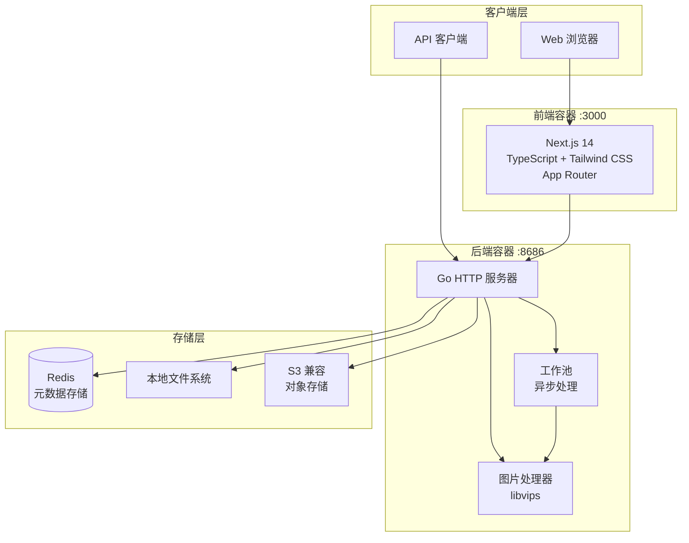

<div align="center">

# ImageFlow


[](https://hub.docker.com/r/losfurina/imageflow-backend)
[](LICENSE)
[](https://go.dev/)
[](https://nextjs.org/)
[](https://deepwiki.com/LosFurina/ImageFlow)

**现代化图片管理与分发平台，支持自动格式优化**

[English](README.md) | [中文文档](README_CN.md)


</div>

---

## 简介

ImageFlow 是一个全栈图片管理与 OpenAPI 平台，包含 Go 图片处理后端、Next.js 管理前端、Redis 元数据、本地/S3 存储，以及面向外部集成的 AK/SK OpenAPI 能力。

## 预览

<div align="center">


</div>

## 系统架构



### 组件概览

| 组件 | 技术栈 | 描述 |
|------|--------|------|
| 前端 | Next.js 14, TypeScript, Tailwind CSS | 现代化 Web 界面，支持拖拽上传 |
| 后端 | Go 1.23+, libvips | 高性能图片处理服务器 |
| 元数据 | Redis | 快速元数据存储，支持标签索引 |
| 存储 | Local / S3 | 灵活的存储后端选项 |

## 功能特性

### 图片处理

- 自动转换为 WebP 和 AVIF 格式
- 基于 libvips 的高性能处理
- 可配置的质量和压缩设置
- 后台工作池异步处理
- GIF 保持原格式（保留动画）

### 智能分发

- 设备感知方向检测（移动端竖屏，桌面端横屏）
- 基于浏览器的格式协商（AVIF > WebP > 原格式）
- 多标签过滤，支持 AND 逻辑
- 敏感内容排除过滤
- 强制方向覆盖选项

### 存储选项

- 本地文件系统存储
- S3 兼容对象存储（AWS S3、MinIO、Cloudflare R2 等）
- 按方向和格式组织的目录结构

### 安全特性

- WebUI 和管理端点使用内部 API Key 认证
- `/openapi/*` 使用外部 AK/SK HMAC 认证
- OpenAPI 客户端支持角色和端点级权限控制
- Redis 中的 SK 加密存储
- 过期图片自动清理
- 可配置的 CORS 策略
- 公共 API 自动排除敏感内容

### 现代化前端

- Next.js 14 App Router
- 拖拽批量上传
- `/manage` 图片管理页面
- AK/SK 管理 Tab，用于外部客户端接入
- 深色模式支持
- 响应式瀑布流布局
- 实时上传进度

## 部署指南

### 环境要求

- 已安装 Docker 和 Docker Compose
- 建议最低 1GB 内存
- 足够的磁盘空间用于图片存储

### 快速开始

```bash
# 克隆仓库
git clone https://github.com/LosFurina/ImageFlow.git
cd ImageFlow

# 创建配置文件
cp .env.example .env

# 编辑配置（参见下方配置说明）
nano .env

# 启动所有服务
docker compose up -d

# 或本地构建用于开发/测试
docker compose -f docker-compose.dev.yaml up --build -d
```

部署完成后：

- Web 界面：`http://localhost:3000`
- 管理页面：`http://localhost:3000/manage`
- 后端 API：`http://localhost:8686`
- OpenAPI 文档：`http://localhost:3000/openapi/docs` 或 `http://localhost:8686/openapi/docs/index.html`

内网访问时把 `localhost` 换成服务器 IP，例如 `http://192.168.1.4:3000`。

### 服务架构

部署包含三个容器：

| 服务 | 端口 | 描述 |
|------|------|------|
| imageflow-frontend | 3000 | Next.js Web 界面 |
| imageflow-backend | 8686 | Go API 服务器 |
| imageflow-redis | 6379 | 元数据存储 |

## 使用流程

### 1. 打开 Web 管理界面

Docker 启动后访问：

- 本机：`http://localhost:3000`
- 内网设备：`http://<服务器内网 IP>:3000`

前端是独立的 Next.js 容器。它会通过自己的 `/api/config` 路由读取运行时后端配置，并自动推导公开后端地址：

- `localhost:3000` -> `localhost:8686`
- `192.168.x.x:3000` -> `192.168.x.x:8686`
- 自定义域名 -> 同一个 host + `IMAGEFLOW_BACKEND_PORT`

只有当后端通过反向代理或不同公开域名暴露时，才需要显式设置 `IMAGEFLOW_PUBLIC_BACKEND_URL`。

### 2. 上传和管理图片

通过 `/manage` 页面进行图片管理。管理页使用内部 `/api/*` 路由，需要 `.env` 中配置的内部 `API_KEY`。

主要能力：

- 上传图片，可设置标签和过期时间
- 查看图片列表和生成后的 URL
- 按标签、方向、格式过滤图片
- 删除图片
- 管理外部 OpenAPI 客户端使用的 AK/SK

### 3. 创建 AK/SK

先启用 AK/SK：

```env
AKSK_ENABLED=true
METADATA_STORE_TYPE=redis
REDIS_HOST=redis
```

然后打开 `/manage`，输入内部 API Key，在 **AK/SK 管理** Tab 创建凭证。

创建 AK/SK 时选择一个角色：

| 角色 | 内置权限 |
|------|----------|
| `reader` | `api:random`, `api:images`, `api:tags`, `api:config` |
| `writer` | reader 权限 + `api:upload` |
| `admin` | writer 权限 + `api:delete`, `api:cleanup`, `api:debug` |

也可以添加自定义权限。自定义权限只会增加权限，不会从角色权限中扣减。

**重要：** Secret Key 只会在创建或轮换时显示一次，请妥善保存。如果泄露，请在 `/manage` 中 rotate。

### 4. 调用 OpenAPI

外部脚本/集成接口位于 `/openapi/*`，使用 AK/SK HMAC 认证。它和 WebUI 内部 `/api/*` 是两套独立认证体系。

OpenAPI 文档：

- 前端入口：`http://localhost:3000/openapi/docs`
- 后端直连：`http://localhost:8686/openapi/docs/index.html`

## 配置说明

在项目根目录创建 `.env` 文件，包含以下设置：

### 核心配置

| 变量 | 必需 | 默认值 | 描述 |
|------|------|--------|------|
| `API_KEY` | 是 | - | WebUI 上传/管理 API 与 AK/SK 管理 API 使用的内部密钥 |
| `STORAGE_TYPE` | 否 | `local` | 存储后端：`local` 或 `s3` |
| `LOCAL_STORAGE_PATH` | 否 | `static/images` | 本地图片存储路径 |
| `DEBUG_MODE` | 否 | `false` | 启用调试日志 |
| `ALLOWED_ORIGINS` | 否 | `*` | CORS 允许来源 |

### OpenAPI / AK/SK 配置

| 变量 | 必需 | 默认值 | 描述 |
|------|------|--------|------|
| `AKSK_ENABLED` | 否 | `false` | 启用 `/openapi/*`、Swagger UI 和 `/api/admin/aksk/*` 管理接口 |
| `API_KEY` | 启用 AK/SK 时必需 | - | 同时用于派生 AES-GCM 密钥，加密 Redis 中的 SK |
| `METADATA_STORE_TYPE` | 启用 AK/SK 时必需 | `redis` | AK/SK 元数据存储在 Redis 中 |

AK/SK 存储行为：

- AK/SK metadata 存在 Redis 的 `imageflow:aksk:{access_key}`。
- SK 不会明文存储，而是使用由 `API_KEY` 派生出的密钥进行 AES-GCM 加密。
- 创建 AK/SK 后如果修改 `API_KEY`，旧 SK 将无法解密；修改 `API_KEY` 后需要 rotate 或重建 AK/SK。

### Redis 配置

| 变量 | 必需 | 默认值 | 描述 |
|------|------|--------|------|
| `METADATA_STORE_TYPE` | 否 | `redis` | 元数据存储类型 |
| `REDIS_HOST` | 否 | `localhost` | Redis 服务器主机名。Docker Compose 内使用 `redis` |
| `REDIS_PORT` | 否 | `6379` | Redis 服务器端口 |
| `REDIS_PASSWORD` | 否 | - | Redis 认证密码 |
| `REDIS_DB` | 否 | `0` | Redis 数据库编号 |
| `REDIS_TLS_ENABLED` | 否 | `false` | 启用 Redis TLS 连接 |

### S3 配置（当 STORAGE_TYPE=s3 时）

| 变量 | 必需 | 默认值 | 描述 |
|------|------|--------|------|
| `S3_ENDPOINT` | 是 | - | S3 端点 URL |
| `S3_REGION` | 是 | - | S3 区域 |
| `S3_ACCESS_KEY` | 是 | - | S3 访问密钥 |
| `S3_SECRET_KEY` | 是 | - | S3 秘密密钥 |
| `S3_BUCKET` | 是 | - | S3 存储桶名称 |
| `CUSTOM_DOMAIN` | 否 | - | S3 资源自定义域名 |

### 图片处理配置

| 变量 | 必需 | 默认值 | 描述 |
|------|------|--------|------|
| `MAX_UPLOAD_COUNT` | 否 | `20` | 单次上传最大图片数 |
| `IMAGE_QUALITY` | 否 | `80` | 转换质量（1-100） |
| `WORKER_THREADS` | 否 | `4` | libvips 并行处理线程数 |
| `WORKER_POOL_SIZE` | 否 | `4` | 并发图片处理工作数 |
| `SPEED` | 否 | `5` | 编码速度（0=最慢/最佳，8=最快） |

### 前端运行时配置

| 变量 | 必需 | 默认值 | 描述 |
|------|------|--------|------|
| `IMAGEFLOW_BACKEND_PORT` | 否 | `8686` | 自动按当前访问主机推导后端地址时使用的公开后端端口 |
| `IMAGEFLOW_PUBLIC_BACKEND_URL` | 否 | - | 反向代理/域名部署时显式指定公开后端 URL；留空则自动使用 `当前主机:8686` |
| `NEXT_PUBLIC_REMOTE_PATTERNS` | 否 | - | 可选的 Next.js 图片域名配置 |

推荐 Docker `.env` 示例：

```env
# 内部 WebUI/管理密钥
API_KEY=change-me-to-a-long-random-value

# OpenAPI / AK/SK
AKSK_ENABLED=true

# 存储
STORAGE_TYPE=local
LOCAL_STORAGE_PATH=static/images
METADATA_STORE_TYPE=redis

# Docker Compose 内部 Redis
REDIS_HOST=redis
REDIS_PORT=6379
REDIS_PASSWORD=
REDIS_DB=0
REDIS_TLS_ENABLED=false

# 图片处理
MAX_UPLOAD_COUNT=20
IMAGE_QUALITY=75
WORKER_THREADS=4
SPEED=5
WORKER_POOL_SIZE=4

# 前端运行时后端发现
IMAGEFLOW_BACKEND_PORT=8686
IMAGEFLOW_PUBLIC_BACKEND_URL=
NEXT_PUBLIC_REMOTE_PATTERNS=

DEBUG_MODE=false
```

## API 参考

ImageFlow 现在有两套 API 命名空间：

| 命名空间 | 使用者 | 认证方式 | 用途 |
|----------|--------|----------|------|
| `/api/*` | WebUI / 内部管理 | `Authorization: Bearer <internal-api-key>` | 上传/管理图片、管理 AK/SK |
| `/openapi/*` | 外部脚本/集成 | AK/SK HMAC Header | 对外集成 API |

不要混用认证方式。`/api/*` 不接受 AK/SK；`/openapi/*` 在 AK/SK 通过后不再要求内部 Bearer key。

### 无认证公开接口

#### 获取随机图片

```http
GET /api/random
```

常用查询参数：

| 参数 | 描述 |
|------|------|
| `tag` | 按单个标签过滤 |
| `tags` | 逗号分隔的多个标签，AND 逻辑 |
| `exclude` | 逗号分隔的排除标签 |
| `orientation` | `portrait` 或 `landscape` |
| `format` | `avif`、`webp` 或 `original` |

示例：

```bash
curl "http://localhost:8686/api/random"
curl "http://localhost:8686/api/random?tags=nature,landscape"
curl "http://localhost:8686/api/random?tag=wallpaper&exclude=nsfw,private"
curl "http://localhost:8686/api/random?orientation=portrait&format=webp"
```

### 内部 WebUI API（`/api/*`）

所有内部管理接口都需要：

```http
Authorization: Bearer <internal-api-key>
```

常用端点：

| 方法 | 路径 | 描述 |
|------|------|------|
| `POST` | `/api/validate-api-key` | 校验内部 API Key |
| `POST` | `/api/upload` | 上传图片，可带标签和过期时间 |
| `GET` | `/api/images` | 列出图片 |
| `POST` | `/api/delete-image` | 按 ID 删除图片 |
| `GET` | `/api/tags` | 列出全部标签 |
| `GET` | `/api/config` | 获取公开客户端配置 |
| `POST` | `/api/trigger-cleanup` | 触发过期图片清理 |

AK/SK 管理端点，也受内部 Bearer key 保护：

| 方法 | 路径 | 描述 |
|------|------|------|
| `GET` | `/api/admin/aksk/list` | 列出 AK/SK；不会返回 SK |
| `POST` | `/api/admin/aksk/create` | 创建 AK/SK；SK 只返回一次 |
| `PUT` | `/api/admin/aksk/update` | 更新名称、描述、角色、自定义权限、启用状态 |
| `DELETE` | `/api/admin/aksk/delete` | 删除 AK/SK |
| `POST` | `/api/admin/aksk/rotate` | 轮换某个 AK 的 SK；新 SK 只返回一次 |

创建 AK/SK 示例：

```bash
curl -X POST "http://localhost:8686/api/admin/aksk/create" \
  -H "Authorization: Bearer <internal-api-key>" \
  -H "Content-Type: application/json" \
  -d '{"name":"demo-client","description":"Demo integration","role":"reader"}'
```

### 外部 OpenAPI（`/openapi/*`）

OpenAPI 端点需要以下 Header：

| Header | 描述 |
|--------|------|
| `X-Access-Key` | 从 `/manage` 或 `/api/admin/aksk/create` 生成的 AK |
| `X-Timestamp` | 秒级 Unix 时间戳，允许 5 分钟误差 |
| `X-Signature` | 使用 SK 生成的 HMAC-SHA256 签名 |

签名字符串格式：

```text
METHOD
PATH_WITHOUT_QUERY
UNIX_TIMESTAMP
SHA256(BODY)
```

说明：

- `METHOD` 使用大写，例如 `GET` 或 `POST`。
- `PATH_WITHOUT_QUERY` 只包含 URL path，例如 `/openapi/images`；`?page=1&limit=3` 不参与签名。
- `BODY` 是请求体的原始字节。空 body 使用空字符串的 SHA256。
- `X-Signature = hex(HMAC-SHA256(SK, string_to_sign))`。

OpenAPI 端点：

| 方法 | 路径 | 权限 | 描述 |
|------|------|------|------|
| `GET` | `/openapi/random` | `api:random` | 获取随机图片，可带过滤参数 |
| `POST` | `/openapi/upload` | `api:upload` | 上传图片 |
| `GET` | `/openapi/images` | `api:images` | 列出图片 |
| `POST` | `/openapi/delete` | `api:delete` | 删除图片 |
| `GET` | `/openapi/tags` | `api:tags` | 列出标签 |
| `GET` | `/openapi/config` | `api:config` | 获取公开配置 |
| `POST` | `/openapi/cleanup` | `api:cleanup` | 触发清理 |
| `GET` | `/openapi/debug/tags` | `api:debug` | 调试标签索引 |

Python 签名示例：

```python
import hashlib
import hmac
import time
import urllib.request

ak = "YOUR_ACCESS_KEY"
sk = "YOUR_SECRET_KEY"
method = "GET"
path = "/openapi/images"
query = "?page=1&limit=3"
body = b""
timestamp = str(int(time.time()))

body_hash = hashlib.sha256(body).hexdigest()
string_to_sign = f"{method}\n{path}\n{timestamp}\n{body_hash}"
signature = hmac.new(sk.encode(), string_to_sign.encode(), hashlib.sha256).hexdigest()

req = urllib.request.Request(
    "http://localhost:8686" + path + query,
    method=method,
    headers={
        "X-Access-Key": ak,
        "X-Timestamp": timestamp,
        "X-Signature": signature,
    },
)

with urllib.request.urlopen(req) as resp:
    print(resp.status)
    print(resp.read().decode())
```

Swagger UI：

```text
http://localhost:3000/openapi/docs
http://localhost:8686/openapi/docs/index.html
```

## 项目结构

```
ImageFlow/
├── main.go                 # 应用入口
├── config/                 # 配置管理
├── auth/                   # AK/SK 签名、权限、SK 加密存储
├── handlers/               # HTTP 请求处理器
│   ├── auth.go             # 内部 API Key 中间件
│   ├── aksk_admin.go       # AK/SK 管理 API
│   ├── openapi.go          # 外部 `/openapi/*` 路由
│   ├── upload.go           # 图片上传处理器
│   ├── random.go           # 随机图片 API
│   ├── list.go             # 图片列表
│   ├── delete.go           # 图片删除
│   └── tags.go             # 标签管理
├── docs/                   # 生成的 Swagger 文档
├── utils/                  # 核心工具
│   ├── converter_bimg.go  # libvips 图片处理
│   ├── storage.go         # 存储接口
│   ├── redis.go           # Redis 操作
│   ├── worker_pool.go     # 异步处理
│   └── cleaner.go         # 过期图片清理
├── frontend/              # Next.js 应用
│   ├── app/               # App Router 页面
│   ├── components/        # React 组件
│   └── utils/             # 前端工具
├── docker-compose.yaml       # Docker 部署（预构建镜像）
├── docker-compose.dev.yaml    # Docker 部署（本地构建）
├── Dockerfile.backend        # 后端容器
├── Dockerfile.frontend       # 前端容器
└── .env.example           # 配置模板
```

## 图片存储结构

```
static/images/
├── original/
│   ├── landscape/         # 原始横屏图片
│   └── portrait/          # 原始竖屏图片
├── landscape/
│   ├── webp/              # WebP 格式横屏
│   └── avif/              # AVIF 格式横屏
├── portrait/
│   ├── webp/              # WebP 格式竖屏
│   └── avif/              # AVIF 格式竖屏
└── gif/                   # GIF 文件（保持原格式）
```

## 许可证

本项目基于 MIT 许可证开源。详见 [LICENSE](LICENSE) 文件。

## 致谢

- [libvips](https://github.com/libvips/libvips) - 高性能图片处理库
- [bimg](https://github.com/h2non/bimg) - libvips 的 Go 绑定
- [Next.js](https://nextjs.org/) - 生产级 React 框架
- [Tailwind CSS](https://tailwindcss.com/) - 实用优先的 CSS 框架
- [Redis](https://redis.io/) - 内存数据存储

## 支持

- [报告问题](https://github.com/LosFurina/ImageFlow/issues)
- [讨论](https://github.com/LosFurina/ImageFlow/discussions)
